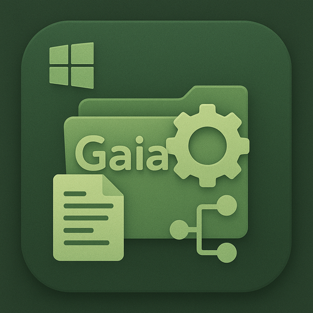

# Gaia - Project Structure Creator

<div align="center">
  
  
  **A powerful, modern GUI application for creating project structures with automated dependency management**
  
  [](https://github.com/PurpleTrex/Apps/releases/latest)
  [](https://github.com/PurpleTrex/Apps/releases/latest)
  [](https://www.oracle.com/java/technologies/downloads/)
</div>

---

## Quick Install

1. **Download** the latest [`Gaia-Setup-1.0.0.exe`](https://github.com/PurpleTrex/Apps/releases/latest)
2. **Run** the installer as administrator
3. **Launch** Gaia from Start Menu or Desktop shortcut
4. **Create** your first project!

## Features

### **Visual Project Builder**
- **Drag & Drop Interface** - Intuitive tree-based project structure creation
- **Real-time Preview** - See your project structure as you build it
- **Professional Templates** - Pre-built structures for popular frameworks

### **Smart Dependency Management**
- **40+ Curated Presets** - Popular dependencies for each project type
- **Custom Dependencies** - Add any package from Maven Central, NPM, PyPI, NuGet
- **Compatibility Checking** - Automatic validation and conflict resolution
- **Version Management** - Latest versions with update suggestions
- **Environment Detection** - Automatically detects installed development tools
- **Conflict Prevention** - Warns about incompatible dependency combinations

### **Multi-Platform Support**
| Platform | Package Manager | File Generation |
|----------|----------------|-----------------|
| **Java** | Maven, Gradle | `pom.xml`, `build.gradle` |
| **Node.js** | NPM, Yarn | `package.json`, `.gitignore` |
| **Python** | Pip, Conda | `requirements.txt`, `setup.py` |
| **Spring Boot** | Maven | Complete Spring configuration |
| **React** | NPM | Modern React setup with TypeScript |
| **Django/Flask** | Pip | Python web framework structure |

### **Modern Windows 11 Design**
- **Native Look & Feel** - Seamlessly integrates with Windows 11
- **Dark/Light Theme** - Automatic theme detection
- **Smooth Animations** - Polished user experience
- **Responsive Layout** - Works on any screen size

## System Requirements

- **Windows 10** (version 1809) or **Windows 11**
- **Java 17 or later** ([Download here](https://www.oracle.com/java/technologies/downloads/))
- **512 MB RAM** minimum
- **200 MB** free disk space

> **Note:** The installer will check for Java and guide you through installation if needed.

## Getting Started

### 1. **Create Your First Project**
1. Launch Gaia from Start Menu
2. Enter project name and location
3. Select project type (Java Maven, Python, React, etc.)
4. Build your folder structure using the tree editor

### 2. **Add Dependencies**
- **Quick Add:** Choose from curated presets for your project type
- **Custom Add:** Search and add any dependency by name
- **Smart Suggestions:** Get compatibility recommendations

### 3. **Generate Project**
- Click "Create Project" to generate all files
- Automatic dependency resolution
- Complete project documentation
- Ready-to-use configuration files

## Documentation

### Built-in Help System
- **Quick Start Tutorial** - Interactive guide for new users
- **Dependency Guide** - How to manage packages effectively  
- **Project Types Overview** - Detailed information about each template
- **Environment Information** - View detected development tools (Tools → Environment Information)
- **Keyboard Shortcuts** - Power user productivity tips
- **Troubleshooting** - Common issues and solutions

### File Associations
Gaia automatically associates with `.gaia` project files:
- **Double-click** any `.gaia` file to open in Gaia
- **Right-click** any file → "Open with Gaia"
- **Save/Load** project templates for reuse

## Advanced Features

### Environment Detection & Validation
- **Automatic Tool Detection** - Detects Java, Maven, Gradle, Node.js, NPM, Python, Pip, Git
- **Pre-Creation Validation** - Warns about missing required tools before project creation
- **Version Information** - View installed versions of all detected tools
- **Project Type Matching** - Ensures required tools are available for selected project type
- **Real-time Status** - Refresh environment information at any time

### Template System
- **Save Templates** - Create reusable project templates
- **Load Templates** - Quick project setup from saved templates
- **Export/Import** - Share templates with your team

### Dependency Compatibility
- **Version Conflict Detection** - Identifies conflicting dependency versions
- **Compatibility Warnings** - Alerts about known incompatibilities (e.g., Django vs Flask)
- **Smart Recommendations** - Suggests compatible versions for your project type
- **Package Manager Validation** - Ensures dependencies match project build tool

### Project Documentation
- **Auto-generated README** - Complete project documentation
- **File Tree Visualization** - Markdown-formatted structure overview
- **Dependency Documentation** - Automatic dependency listings

### Integration Support
- **Git Integration** - Automatic `.gitignore` generation
- **IDE Support** - Compatible with VS Code, IntelliJ, Eclipse
- **Build Tool Integration** - Maven, Gradle, NPM script generation

## What's New in v1.0.0

- **Environment Detection System** - Automatically detects installed development tools
- **Enhanced Dependency Validation** - Advanced conflict detection and version compatibility checking
- **Environment Information Dialog** - View all detected tools and their versions (Tools menu)
- **Pre-Creation Validation** - Warns about missing tools before project creation
- **Modern splash screen** with beautiful animations
- **Silent installation** - No command prompt windows
- **Enhanced dependency presets** - 40+ curated packages
- **Improved file associations** - Better Windows integration
- **Professional installer** - One-click installation experience
- **Comprehensive tutorials** - Built-in help system
- **Performance improvements** - Faster project generation

## Troubleshooting

### Common Issues

**Application won't start?**
- Ensure Java 17+ is installed
- Try running as administrator
- Check Windows Event Viewer for detailed errors

**Dependencies not found?**
- Verify internet connection
- Check repository availability
- Try using custom dependency input
- Use Tools → Environment Information to verify package managers are installed

**Missing development tools?**
- Use Tools → Environment Information to check which tools are detected
- Install required tools for your project type (e.g., Maven for Java Maven projects)
- Refresh environment detection after installing new tools

**Project generation fails?**
- Ensure sufficient disk space
- Check write permissions to target directory
- Verify project name doesn't contain special characters

### Getting Help
- **Built-in Help:** Press `F1` or click the `?` button
- **Issues:** [Report bugs on GitHub](https://github.com/PurpleTrex/Apps/issues)
- **Discussions:** [Community forum](https://github.com/PurpleTrex/Apps/discussions)

## License

Licensed under the MIT License. See [LICENSE](LICENSE.txt) for details.

## Contributing

This project welcomes contributions! Whether it's:
- **Bug reports** - Help us improve stability
- **Feature requests** - Suggest new functionality  
- **Documentation** - Improve user guides
- **UI/UX improvements** - Enhance user experience

---

<div align="center">
  
**Built with love for developers, by developers**

[Download Now](https://github.com/PurpleTrex/Apps/releases/latest) • [View Screenshots](https://github.com/PurpleTrex/Apps/wiki/Screenshots) • [Report Issues](https://github.com/PurpleTrex/Apps/issues)

</div>
cd StructureCreation

# Build the project
mvn clean compile

# Run the application
mvn javafx:run
```

### Creating Executable JAR
```bash
# Build with all dependencies
mvn clean package

# Run the JAR file
java -jar target/project-structure-creator-1.0.0-shaded.jar
```

### Development Mode
```bash
# For development with auto-reload
mvn javafx:run -Djavafx.args="--add-modules javafx.controls,javafx.fxml"
```

## Usage Guide

### 1. Project Setup
1. **Enter Project Name**: Give your project a meaningful name
2. **Select Location**: Choose where to create the project
3. **Choose Project Type**: Select from available templates or use Custom

### 2. Building Structure
1. **Add Folders**: Click the folder icon to add directories
2. **Add Files**: Click the file icon to add files
3. **Organize Structure**: Drag and drop to reorganize (rename/delete as needed)
4. **Preview Structure**: See your structure in the tree view

### 3. Managing Dependencies
1. **Select Dependency Type**: Choose package manager (Maven, NPM, Pip, etc.)
2. **Enter Package Details**: Add package name and version
3. **Add to Project**: Click "Add Dependency"
4. **Review Dependencies**: See all dependencies in the table

### 4. Project Creation
1. **Validate Input**: Ensure all required fields are filled
2. **Create Project**: Click "Create Project"
3. **Monitor Progress**: Watch the progress bar for completion status
4. **Review Results**: Check the generated `fileTree.md` for documentation

## Project Structure

```
StructureCreation/
├── pom.xml                                 # Maven configuration
├── README.md                               # This file
├── fileTree.md                            # Auto-generated documentation
└── src/
    └── main/
        ├── java/
        │   └── com/
        │       └── structurecreation/
        │           ├── ProjectStructureCreatorApp.java    # Main application
        │           ├── controller/
        │           │   └── MainController.java            # UI controller
        │           ├── model/
        │           │   ├── ProjectNode.java               # Tree node model
        │           │   ├── ProjectStructure.java          # Project data model
        │           │   └── Dependency.java                # Dependency model
        │           ├── service/
        │           │   ├── ProjectCreationService.java    # Project creation logic
        │           │   └── FileTreeGenerator.java         # Documentation generator
        │           └── util/
        │               └── AlertUtils.java                # UI utilities
        └── resources/
            ├── fxml/
            │   └── main.fxml                              # UI layout
            ├── css/
            │   └── styles.css                             # Modern styling
            └── images/
                └── app-icon.png                           # Application icon
```

## Features in Detail

### Template System
The application includes intelligent templates that generate appropriate project structures:

- **Java Maven**: Creates standard Maven directory structure with `src/main/java`, `src/test/java`, and proper `pom.xml`
- **Spring Boot**: Adds Spring Boot specific configuration and main application class
- **React**: Sets up React project with `public`, `src` directories and `package.json`
- **Python**: Creates Python package structure with `setup.py` and `requirements.txt`

### Dependency Integration
Dependencies are automatically integrated into project configuration files:

- **Maven**: Added to `pom.xml` with proper formatting
- **Gradle**: Integrated into `build.gradle` with correct syntax
- **NPM**: Added to `package.json` dependencies section
- **Python**: Listed in `requirements.txt` with proper versioning

### Documentation Generation
The `fileTree.md` file includes:

- Complete project structure visualization
- File and folder descriptions
- Dependency information with installation commands
- Build and run instructions specific to project type
- Development tips and best practices

## Customization

### Adding New Project Types
1. Create a new template generator in `ProjectCreationService`
2. Add project type to the combo box options
3. Implement specific file generation logic

### Extending Dependency Support
1. Add new dependency type to `Dependency` model
2. Implement formatting logic in `getFormattedDependency()`
3. Add installation commands in `ProjectCreationService`

### UI Customization
- Modify `styles.css` for appearance changes
- Update `main.fxml` for layout modifications
- Extend `MainController` for new functionality

## System Requirements

### Minimum Requirements
- **OS**: Windows 10/11, macOS 10.14+, Linux (Ubuntu 18.04+)
- **Java**: OpenJDK or Oracle JDK 17+
- **RAM**: 512 MB minimum, 1 GB recommended
- **Storage**: 100 MB for application, additional space for generated projects

### Recommended Requirements
- **Java**: Latest LTS version (Java 21+)
- **RAM**: 2 GB or more
- **Storage**: 1 GB+ free space

## Troubleshooting

### Common Issues

**Application won't start**
- Verify Java 17+ is installed: `java --version`
- Check JavaFX modules are available
- Try running with explicit module path

**Project creation fails**
- Ensure target directory has write permissions
- Check if required tools are installed (Maven, Node.js, Python, etc.)
- Verify internet connection for dependency downloads

**Dependencies not installing**
- Check if package managers are in system PATH
- Verify dependency names and versions are correct
- Ensure network connectivity for package downloads

### Getting Help
1. Check the application logs in the console output
2. Verify all prerequisites are installed
3. Review the generated `fileTree.md` for project-specific guidance

## Contributing

This is a self-contained application. To contribute:

1. Fork the project
2. Create feature branches
3. Follow Java coding standards
4. Test all functionality before submitting
5. Update documentation as needed

## License

This project is created for educational and development purposes. Feel free to modify and extend as needed.

## Version History

- **v1.0.0**: Initial release with full functionality
  - Modern Windows 11 style UI
  - Multi-language project support
  - Comprehensive dependency management
  - Automatic documentation generation
  - Complete project templates

